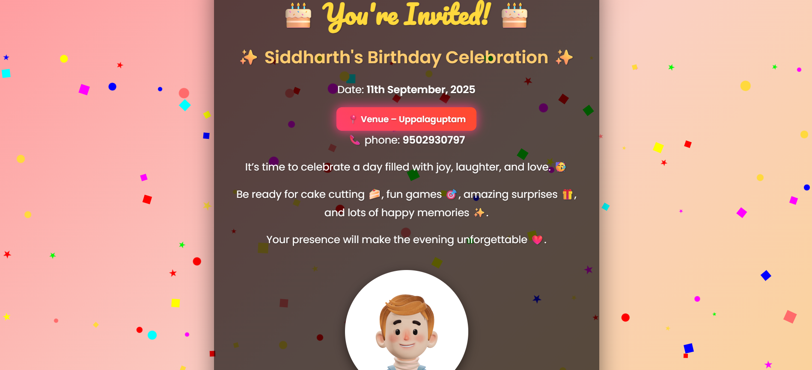

# 🎂 Siddharth's Birthday Invitation 🎉

This is a **beautiful animated birthday invitation webpage** created using **HTML, CSS, and JavaScript**.  
It includes confetti background, event details, and a clickable animated venue link that opens directly in **Google Maps**.

---

## 🚀 Features
- 🎨 Attractive and responsive design  
- 🎉 Confetti animation background  
- 📅 Date and event details clearly highlighted  
- 📍 Animated Venue link (opens Google Maps)  
- 🥳 Fun emojis for a lively touch  

---

## 📍 Venue
Click the animated venue button to view the location:  

[📍 Uppalaguptam, Andhra Pradesh](https://www.google.com/maps/place/Uppalaguptam,+Andhra+Pradesh+533222/@16.552299,82.0965581,15z)

---

## 🛠️ Technologies Used
- **HTML5**  
- **CSS3 (Animations, Gradient Effects, Styling)**  
- **JavaScript** (Confetti effect)  

---

## 📷 Preview


---

## ⚡ How to Run
1. Clone the repo  
   ```bash
   git clone https://github.com/<your-username>/birthday-invite.git
